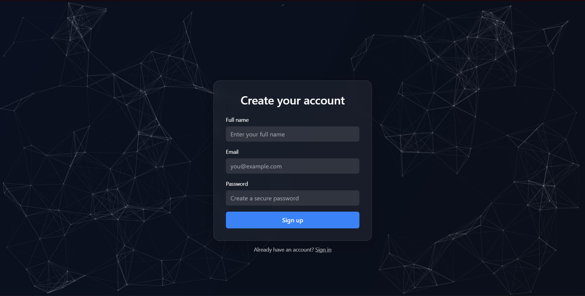
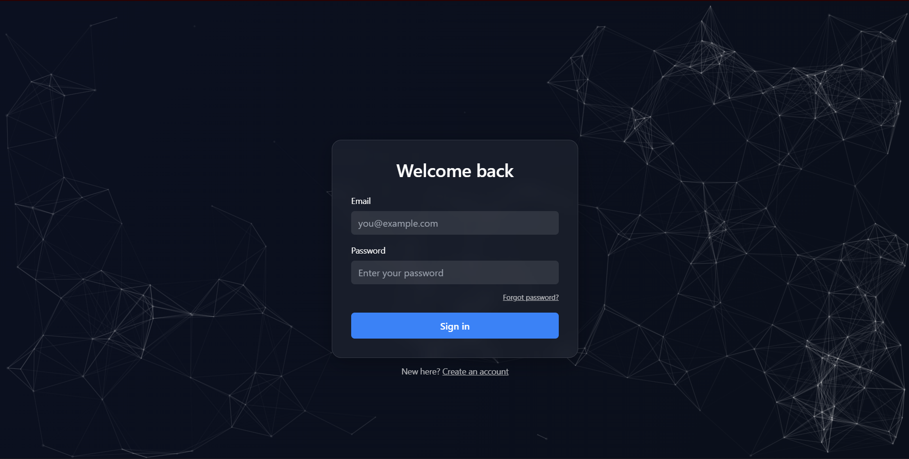
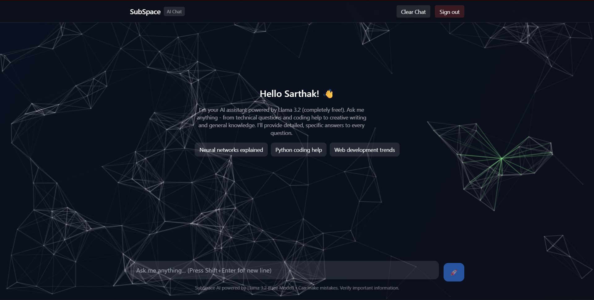
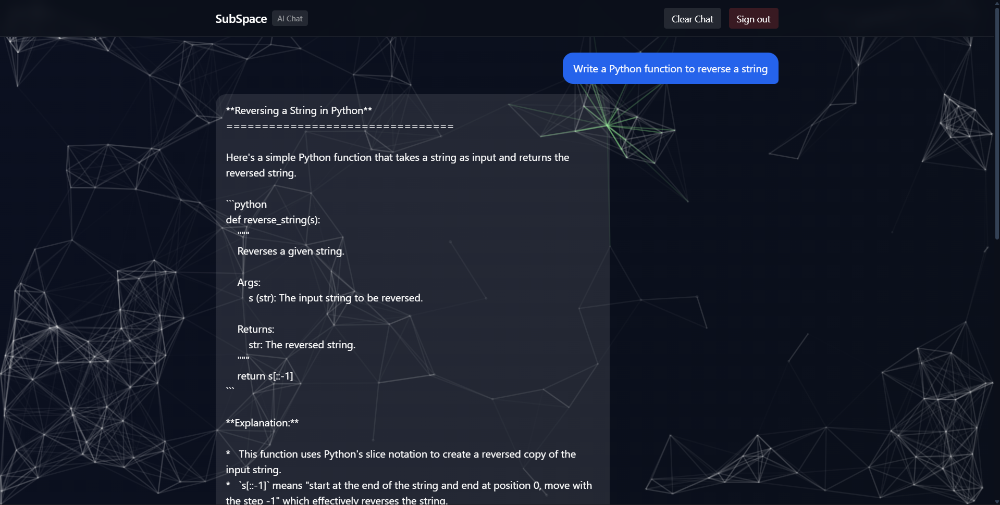

# SubSpace-Ai

# 🌌 SubSpace – AI-Powered Auth & Chat Platform

SubSpace is a modern authentication and chatbot interface built with **React + TailwindCSS**.  
It features smooth **animated backgrounds**, secure **authentication flows**, and a responsive design for a futuristic feel 🚀.

---

## ✨ Features

- 🔐 **Authentication**
  - Sign Up / Sign In pages
  - Password validation & error handling
  - Forgot password option

- 🎨 **UI & Experience**
  - Glassmorphism-styled Auth cards
  - Animated particle background
  - Dynamic text with typewriter effect

- ⚡ **Tech Stack**
  - React + Vite
  - React Router DOM
  - TailwindCSS
  - Supabase / Nhost backend ready
  - n8n Workflow integration (planned)

---

## 📸 Screenshots

### 🆕 Sign Up


### 🔐 Sign In


### 💬 Chat Interface




---

## 🚀 Getting Started

### Install dependencies
npm install

###Setup environment variables

Create a .env file in the root:

VITE_SUPABASE_URL=your_supabase_url
VITE_SUPABASE_KEY=your_supabase_anon_key
HF_API_KEY=your_huggingface_key
HF_MODEL=your_huggingface_model

###Run the project

npm run dev

---

## 🤝 Contributing

Contributions, issues, and feature requests are welcome!
Feel free to fork the repo and create a pull request.

---

##📜 License

This project is licensed under the MIT License.

---

## 👨‍💻 Author

**Sarthak Roy**  
🔗 [GitHub](https://github.com/SarthakRoy-1) | [LinkedIn](https://www.linkedin.com/in/sarthak-roy-140308217/) | ✉️ [sarthakroy40@gmail.com](mailto:sarthakroy40@gmail.com)


---

### 1️⃣ Clone the repository
```bash
git clone https://github.com/SarthakRoy-1/SubSpace-Ai.git
cd SubSpace-Ai

